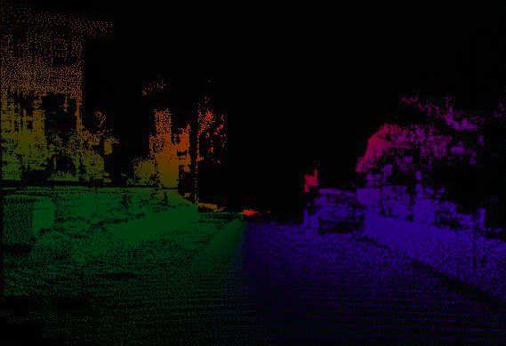
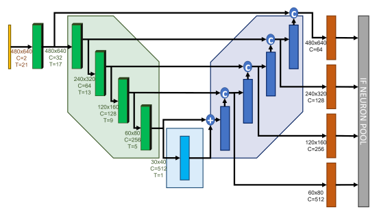
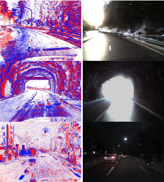

# **TFG-DSEC-Egomotion-SNN**

Este repositorio forma parte del **Proyecto de Fin de Grado en Ingeniería Informática y ADE** de la Universidad de Granada, y explora el uso de **redes neuronales tradicionales y redes neuronales de impulsos (SNNs)** para la **estimación de egomotion** a partir de datos capturados con cámaras de eventos (dataset DSEC).

<p align="center">

</p>

## Estructura del proyecto

A continuación se describen los archivos y carpetas principales:

- **egomotiondataset.py**  
  Contiene el código y utilidades necesarios para cargar, preprocesar y preparar el dataset DSEC adaptado al problema de egomotion.

- **egomotionnet.py**  
  Implementación de distintas arquitecturas de **redes neuronales artificiales (ANNs)** para estimación de egomotion.

- **spikingegomotionnet.py**  
  Implementación de variantes **Spiking Neural Networks (SNNs)** inspiradas en las redes anteriores, orientadas a un procesamiento bio-inspirado basado en eventos.

- **obtener_gt.py**  
  Script para generar o extraer el **ground truth** de egomotion, que servirá como etiqueta en el entrenamiento supervisado.

- **train_egomotion_net.py**  
    Implementación del entrenamiento, validación y test de las redes ANNs.

- **train_spikingegomotionnet.py**  
    Implementación del entrenamiento, validación y test de las redes SNNs.

Se recomienda una carpeta adicional llamada `dataset` donde se introduzcan los arrays de numpy con el ground truth tanto de ego-motion como de flujo óptico.

Estructura recomendada:

```
TFG-DSEC-Egomotion-SNN/
    ├── dataset/
    │      ├─── gp_ego_motion.py
    |      ├─── optical_flow.npy
    |      ├─── test_gt_ego_motion.npy
    │      └─── test_optical_flow.npy
    └── ...
```
## Requisitos

El proyecto se ha desarrollado usando Python 3.8+ y requiere varias librerías, como:
- PyTorch (para ANN y SNN)
- NumPy
- Matplotlib
- OpenCV
- Wandb
- SpikingJelly

Puedes instalar las dependencias recomendadas ejecutando:
```bash
pip install -r requirements.txt
```
## Como ejecutar
A modo de ejemplo: 
```
python obtener_gt.py
```
o 
```
python train_egomotion_net.py
```

Puedes modificar las configuraciones, arquitecturas o hiperparámetros directamente en los scripts.

## Resultados

Este proyecto incluye el entrenamiento y evaluación de varios modelos: 

- Modelos ANN tradicionales para estimación de egomotion.
- Modelos SNN para demostrar la viabilidad del enfoque bio-inspirado.
- Análisis de métricas como pérdida (loss) y RMSE en conjuntos de validación y prueba.

Los resultados completos se encuentran descritos en la memoria del TFG en la Universidad de Granada con título **Redes Neuronales de Impulsos (SNNs) para aprendizaje bio-inspirado**.

## Red extractora de flujo óptico
He usado la red propuesta en https://github.com/J-Cuadrado/OF_EV_SNN para generar el flujo óptico necesario para entrenar los modelos y obtener el correspondiente ego-motion asociado a esas estimaciones de flujo  óptico. 

<p align="center">

</p>

## Sobre el dataset
Se utiliza el dataset DSEC (Zurich Dataset for Stereo and Event Cameras): https://dsec.ifi.uzh.ch/dsec-datasets/download/.

<p align="center">

</p>

DSEC es un conjunto de datos que se compone de grabaciones obtenidas en entornos reales de conducción utilizando un sistema estéreo formado por cámaras de eventos monocromáticas y cámaras RGB con obturador global. Las capturas se realizaron bajo distintas condiciones de iluminación, incluyendo tanto escenarios favorables como otros más exigentes, como cambios bruscos de luz. Además, incorpora datos complementarios procedentes de sensores LiDAR y posicionamiento GPS de alta precisión, todos ellos sincronizados a nivel de hardware para garantizar la coherencia temporal entre los distintos dispositivos. 

## Autor
Este proyecto de fin de grado ha sido realizado por **Alejandro Torres Martínez** y tutorizado por **Francisco Barranco Expósito**.


